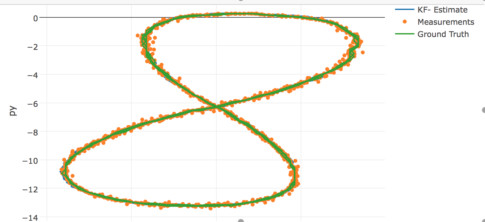
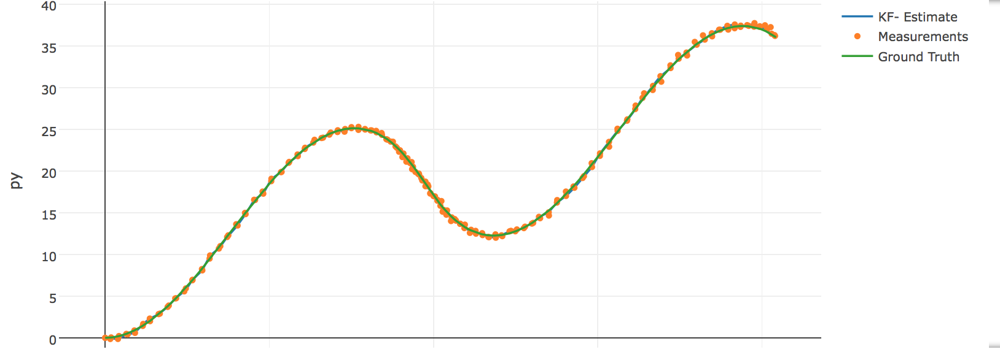

# Extended Kalman Filter Project

---

## Dependencies

* cmake >= 3.5
 * All OSes: [click here for installation instructions](https://cmake.org/install/)
* make >= 4.1
  * Linux: make is installed by default on most Linux distros
  * Mac: [install Xcode command line tools to get make](https://developer.apple.com/xcode/features/)
  * Windows: [Click here for installation instructions](http://gnuwin32.sourceforge.net/packages/make.htm)
* gcc/g++ >= 5.4
  * Linux: gcc / g++ is installed by default on most Linux distros
  * Mac: same deal as make - [install Xcode command line tools]((https://developer.apple.com/xcode/features/)
  * Windows: recommend using [MinGW](http://www.mingw.org/)

## Basic Build Instructions

1. Clone this repo.
2. Make a build directory: `mkdir build && cd build`
3. Compile: `cmake .. && make`
4. Run it: `./ExtendedKF path/to/input.txt path/to/output.txt`. You can find
   some sample inputs in 'data/'.
    - eg. `./ExtendedKF ../data/sample-laser-radar-measurement-data-1.txt output.txt`

## Usage
Input and Output files are required

Usage:
Extended_Kalman_Filter [OPTION...] positional parameters

-h, --help        Print help

-i, --input arg   Input File

-o, --output arg  Output file

-v, --verbose     verbose flag

-r, --radar       use only radar data

-l, --lidar       use only lidar data


# Results

### Input file format
The Input file format looks like this way:


|L(for laser)| meas_px |meas_py |timestamp       | gt_px |gt_py |gt_vx   | gt_vy |
|:-----------|:--------|:-------|:---------------|:------|:-----|:-------|:-----|
|L	         |8.45	   |0.25	|1477010443349642|	8.45  |	0.25 |-3.00027|	0    |

---

|R(for radar)| meas_rho|meas_phi|meas_rho_dot |timestamp | gt_px |gt_py |gt_vx | gt_vy |
|:-----------|:--------|:-------|:------------|:---------|:-----|:-------|:-----|:------|
|R	         |8.60363  |0.0290616|-2.99903  |1477010443399637|	8.6  |	0.25 |-3.00029|	0 |

	
** The EKF Algorithm reads form file reads all the lines and generates measurement structures**
** The `MeasurementProcessor( )` is called with individual measurements (one by one). **
** The results are saved**


### Output file format
The output file format looks like this way:

|est_px| est_py |est_vx|est_vy |meas_px |meas_py| gt_px |gt_py |gt_vx | gt_vy |
|:-----|:--------|:----|:------|:--------|:------|:-----|:-------|:-----|:-----|
|      |       |       |    |      |     |      |      |        |      |


|    Input file 1 - Fused    |         RMSE                                              |
| -------------------------- |:----------------------------------------------------------|
| | px=0.0322224<br>py=0.0318495<br>vx=0.367636<br>vy=0.414091 |


|    Input file 2 - Fused    |         RMSE                                              |
| -------------------------- |:----------------------------------------------------------|
| | px=0.177884<br>py=0.192463<br>vx=0.58447<br>vy=1.640691 |


```python

```
